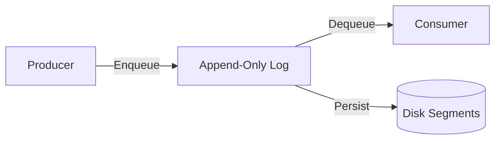
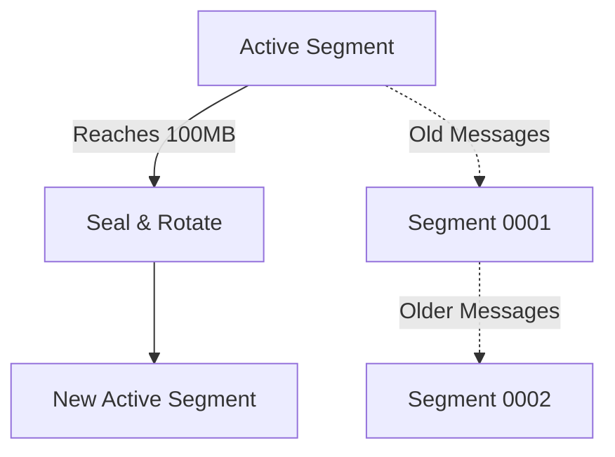
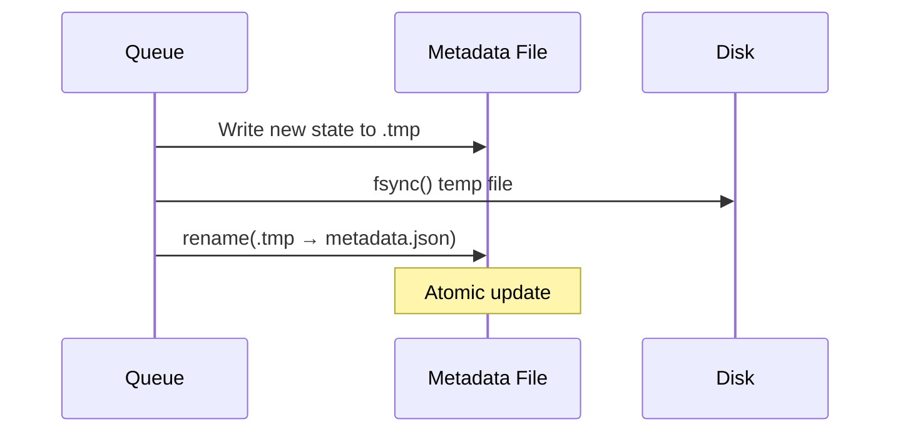
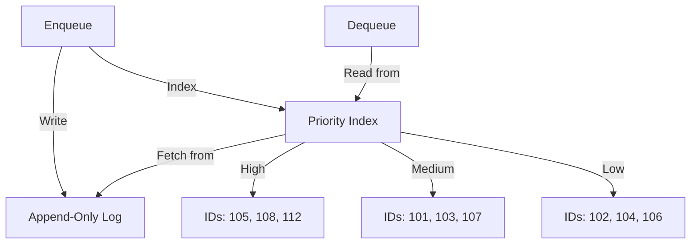
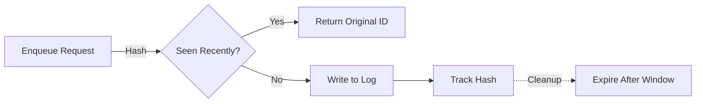
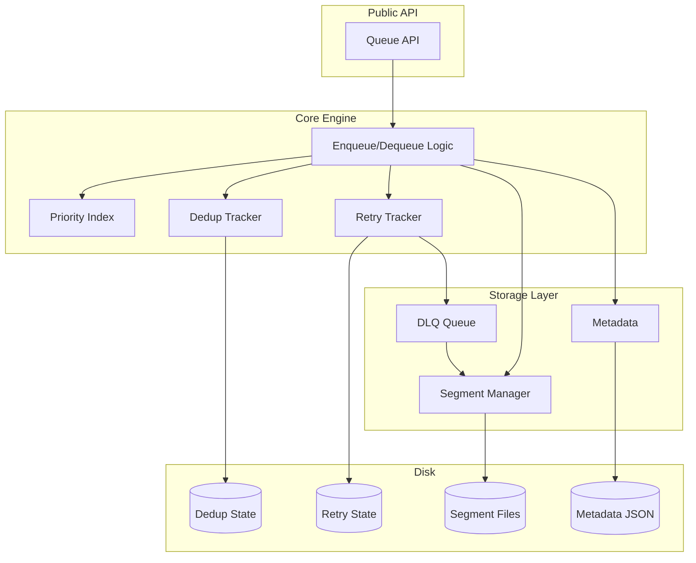

# Building LedgerQ: A Journey Through Message Queue Internals

When I started building LedgerQ, I had a simple problem: I needed a reliable task queue for a CLI tool, but running Kafka or RabbitMQ felt like bringing a semi-truck to pick up groceries. Something was missing in the ecosystem—a message queue that was just a library you could embed, with zero setup and no network overhead.

What started as a weekend project turned into a fascinating deep dive into message queue internals, crash recovery, and the surprisingly tricky art of writing data to disk safely.

## The Core Idea

The fundamental concept is beautifully simple: an append-only log. Messages go in, they get written to disk in order, and they never change. Think of it like a write-only ledger (hence the name).



But the devil, as always, lives in the details.

## Phase 1: Getting the Basics Right (v1.0.0)

The first version had one job: don't lose messages. Ever.

### The Append-Only Log

Every message gets assigned a monotonically increasing ID. Write it to disk with a simple binary format:

```
[Message ID][Timestamp][Payload Length][Payload][Checksum]
```

The checksum caught corruption early. The timestamp let us know when things were written. The message ID gave us ordering and seeking. Simple, but it worked.

### Segments: Because Files Can't Grow Forever

One file would eventually become unwieldy (and slow to compact), so I borrowed from Kafka's playbook: split the log into segments. When a segment reaches a certain size (default 100MB), rotate to a new one.



Now we had crash recovery. If the process dies mid-write, the worst that happens is a partial message at the end of the active segment. We scan backward from the end, verify checksums, and truncate the garbage.

### The Read Position Problem

Here's where it got interesting. How do you track what's been consumed?

Initially, I kept it in memory. Bad idea. After a restart, you'd re-process everything from the beginning. For a task queue, that's often fine (tasks are idempotent, right?), but it felt wrong.

The solution: persist the read position in a metadata file. Atomic writes using `rename()` ensure we never corrupt it, even during a crash.



This gave us exactly-once consumption semantics (within a single consumer). A message dequeued stays dequeued, even across crashes.

## Phase 2: Real-World Features (v1.1.0 - v1.2.0)

Once the core was solid, the requests started coming in. "Can it do TTL?" "What about priorities?" "How do I handle failed messages?"

### Message TTL: Time is a Dimension Too

Some messages expire. Event notifications, temporary tasks, cache invalidation signals—they all have a shelf life.

Adding expiration was straightforward: store an `ExpiresAt` timestamp in each message. The trick was doing it efficiently. We don't want to scan every message on every dequeue to check expiration.

Solution: lazy evaluation. Check TTL when you dequeue. If it's expired, skip it and keep going. A background compaction process cleans up the expired messages later, reclaiming disk space.

```go
// Simplified dequeue logic
func (q *Queue) Dequeue() (*Message, error) {
    for {
        msg := q.readNext()
        if msg.IsExpired() {
            continue  // Skip expired, keep reading
        }
        return msg, nil
    }
}
```

### Priority Queues: Not All Messages Are Equal

Some messages are more important than others. Alarm notifications should jump ahead of routine cleanup tasks.

This one was trickier. We still write to the append-only log in arrival order (that's how we maintain durability), but we need to dequeue in priority order.

The solution: an in-memory priority index. Three levels (High, Medium, Low), each maintaining a sorted list of message IDs. When you enqueue with a priority, the message goes to disk normally, but its ID also goes into the priority index.



On startup, we rebuild the index by scanning unprocessed messages. It's O(n) at startup, but dequeue stays O(log n) thanks to Go's heap-based priority queue.

We also added starvation prevention—low-priority messages get a boost if they've been waiting too long. Nobody likes a message that never gets processed.

### Dead Letter Queue: When Things Go Wrong

In production, messages fail. Network timeouts, malformed data, bugs in processing logic—the reasons are endless.

The Dead Letter Queue (DLQ) pattern is simple: track retry counts, and after N failures, move the message to a separate queue for manual inspection.

We used a separate LedgerQ instance for the DLQ (eat your own dog food!), plus a JSON file to track retry state:

```json
{
  "105": {
    "retry_count": 3,
    "last_failure": "2025-10-21T10:30:00Z",
    "failure_reason": "connection timeout"
  }
}
```

The API became: `Ack()` to mark success, `Nack()` to mark failure. After `MaxRetries` nacks, the message automatically moves to the DLQ with all its failure metadata preserved in headers.

## Phase 3: Optimization and Polish (v1.3.0 - v1.4.0)

At this point, LedgerQ was functional. But functional isn't the same as production-ready.

### Compression: Storage is Finite

When you're writing JSON payloads to disk all day, file sizes add up fast. GZIP compression was an obvious win—50-70% savings for typical text/JSON payloads.

But compression has costs: CPU time and latency. So we added configurability:
- Compression level (1-9, defaulting to 6)
- Minimum size threshold (don't compress tiny messages)
- Smart compression (skip if savings < 5%)
- Decompression bomb protection (limit output size)

The result: opt-in compression that's safe and efficient. Enable it globally, or per-message if you want fine-grained control.

### Deduplication: Exactly-Once Semantics

The final piece of the puzzle: what if the same message gets enqueued twice? Network retries, DLQ requeuing, webhook duplicate deliveries—duplicates happen.

SHA-256 hashing to the rescue. Before enqueueing, compute a hash of the message and deduplication ID:

```go
hash := sha256.Sum256([]byte(dedupID))
```

Check if we've seen this hash in the last N minutes (configurable window). If yes, reject it (or return the original message ID). If no, enqueue and track the hash.

The tracking uses a time-windowed map with background cleanup every 10 seconds. Memory bounded, crash-safe (we persist to disk), and completely optional.



This gave us exactly-once semantics without coordination or distributed locks. Perfect for single-node use cases.

## The Architecture Today

After four major releases and 13 features, here's what the architecture looks like:



Each component has a clear responsibility:
- **Segment Manager**: handles file I/O, rotation, compaction
- **Metadata**: persists queue state (read/write positions)
- **Priority Index**: in-memory heap for priority ordering
- **Retry Tracker**: manages failure counts and DLQ routing
- **Dedup Tracker**: prevents duplicate processing

## What I Learned

Building LedgerQ taught me more about distributed systems than any book or tutorial:

1. **Durability is Hard**: Ensuring data survives crashes requires thinking about fsync, atomic writes, and crash recovery at every layer.

2. **Performance ≠ Complexity**: The fastest path is often the simplest. Append-only logs beat complex indexing because sequential I/O is ridiculously fast.

3. **Defaults Matter**: Features should be opt-in. Priorities, compression, deduplication—all disabled by default. Users enable what they need.

4. **Scope Creep is Real**: I constantly had to ask: "Is this still a local-first queue, or am I building Kafka?" Knowing when to stop is as important as knowing what to build.

5. **Testing is Everything**: Fuzzing found edge cases I never would have thought of. Race detection caught concurrency bugs before production did.

## Why Stop at v1.4.0?

There are features we could add—consumer groups, transactions, webhooks. But each one pushes LedgerQ further from its core mission: being an excellent local message queue.

Consumer groups imply distributed coordination. Transactions need write-ahead logs and two-phase commit. Webhooks require HTTP servers and retry logic. These are all solved problems in other systems (Kafka, NATS, RabbitMQ).

LedgerQ's value isn't competing with them. It's being the thing you reach for when you need persistent queuing without operational overhead. Zero config, zero network, zero external dependencies. Just a directory path.

Feature-complete doesn't mean perfect. It means it does what it set out to do, and it does it well.

## Try It Yourself

If you're building CLI tools, desktop apps, edge devices, or anything else that needs local task queuing, give LedgerQ a shot:

```bash
go get github.com/vnykmshr/ledgerq/pkg/ledgerq@latest
```

The [examples/](examples/) directory has 11 runnable examples covering everything from basic operations to advanced features. Start with `examples/simple` and work your way up.

And if you're curious about message queue internals, the codebase is intentionally readable. No magic, no clever tricks—just straightforward Go that does what it says.

## What's Next?

For LedgerQ: maintenance mode. Bug fixes, performance improvements, documentation polish. No new features planned.

For me: I learned what I wanted to learn. Message queues aren't magic—they're careful engineering around simple primitives (files, checksums, atomic operations). And sometimes, the best feature is knowing when to stop.

---

*LedgerQ is Apache 2.0 licensed and available at [github.com/vnykmshr/ledgerq](https://github.com/vnykmshr/ledgerq).*

*Built as a learning project for message queue internals and Go systems programming.*
