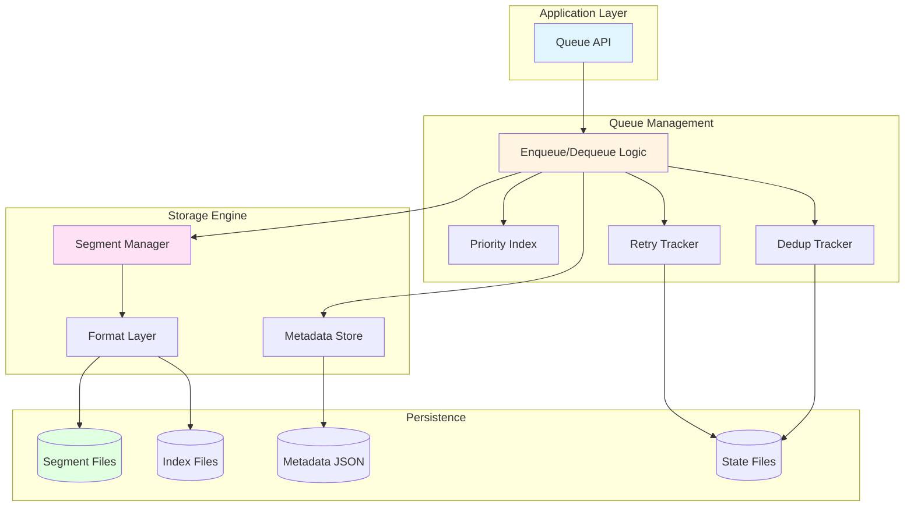
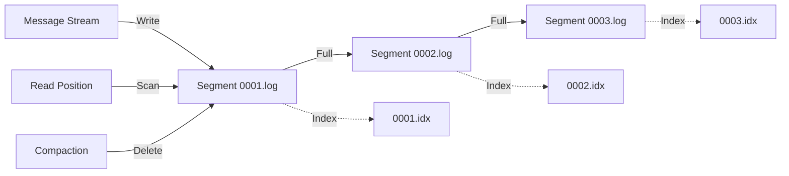
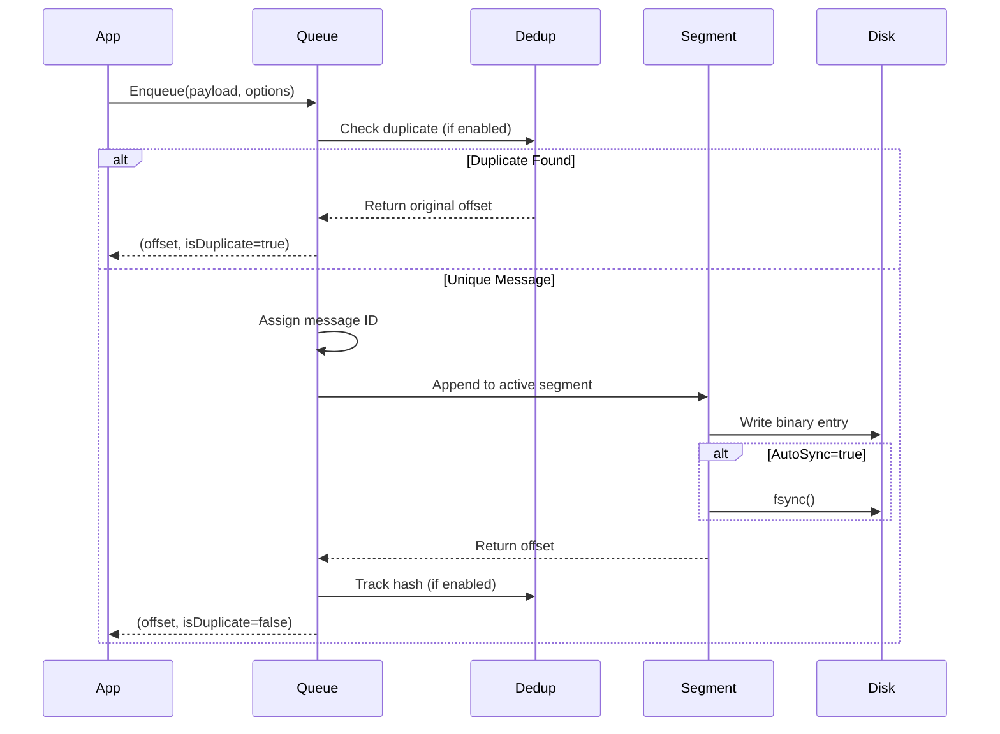
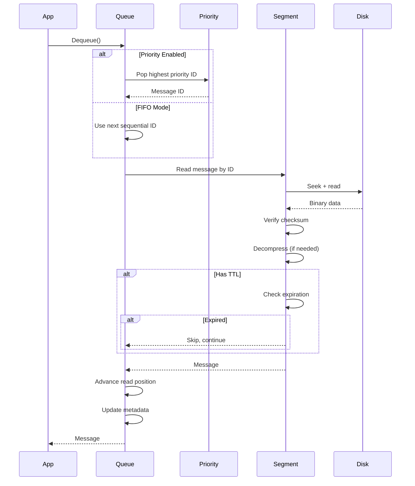
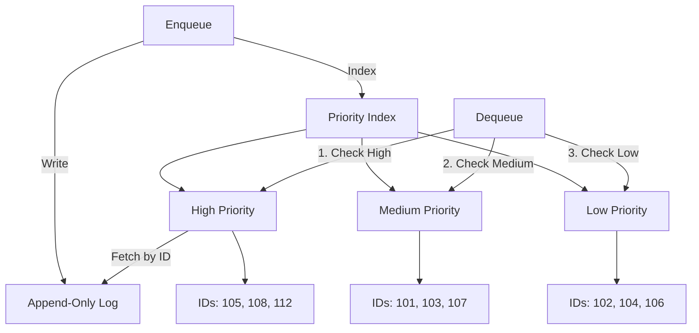
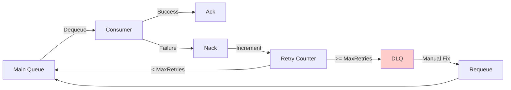
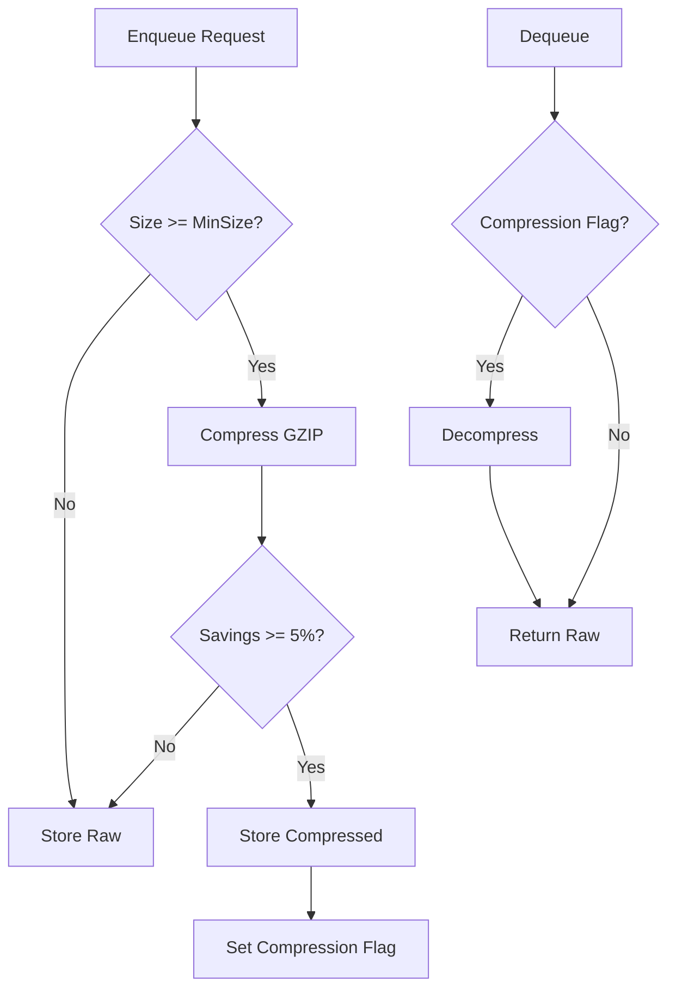
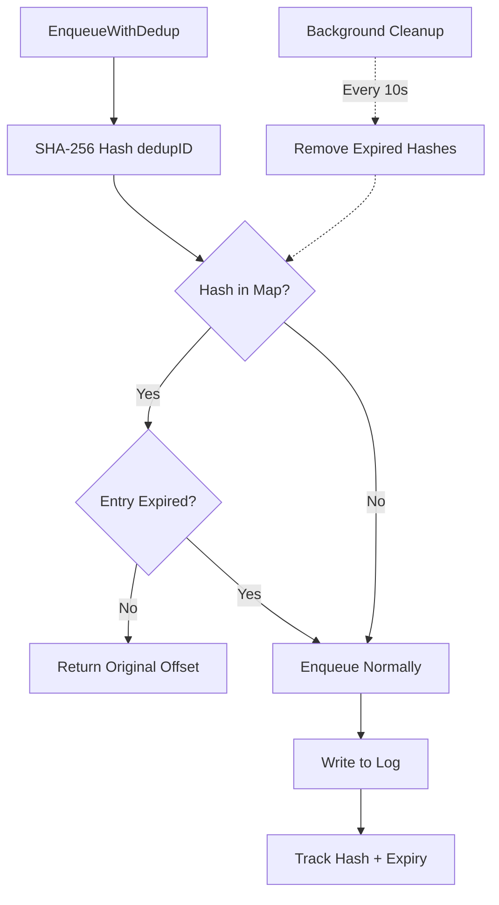
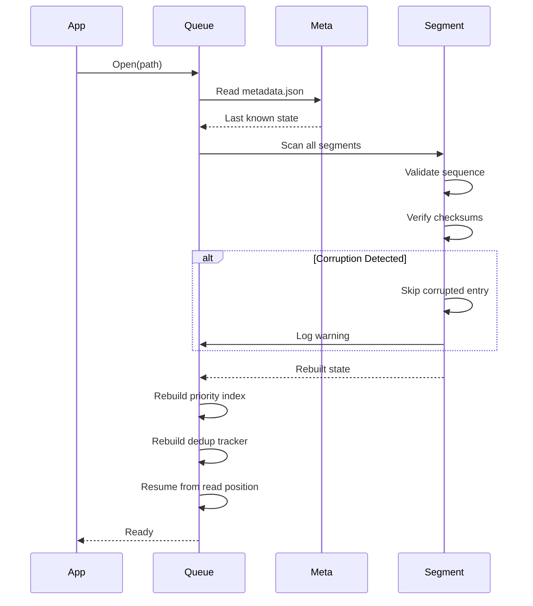

# LedgerQ: Disk-Backed Message Queue Architecture for Single-Node Systems

## Introduction

Distributed message queues like Kafka and RabbitMQ excel at network-based messaging across clusters, but many applications need something simpler: a reliable, crash-safe task queue within a single process. LedgerQ addresses this gap by providing an embedded message queue with disk persistence, zero external dependencies, and production-ready reliability guarantees.

This post examines LedgerQ's architecture, storage design, and the trade-offs inherent in building a local-first message queue.

## Problem Space

### The Gap in Message Queue Ecosystems

Modern applications often need to:
- Queue background tasks that survive process restarts
- Maintain ordered processing with crash recovery
- Handle retry logic and dead letter patterns
- Operate in edge environments without network dependencies

Existing solutions fall short:
- **Kafka/RabbitMQ**: Require separate processes, network configuration, and operational overhead
- **In-memory channels**: Lose data on crash
- **Database queues**: Add database dependencies and polling overhead
- **File-based queues**: Most implementations lack durability guarantees or advanced features

LedgerQ provides message queue semantics with disk durability, no network layer, and the simplicity of a single Go library.

## Architecture Overview

LedgerQ uses a log-structured storage design with four core components:



### Component Responsibilities

**Queue API Layer** (`pkg/ledgerq/`): Stable public interface with configuration options, type conversions, and adapter patterns for logging/metrics.

**Queue Management** (`internal/queue/`): Core business logic including message routing, TTL handling, priority scheduling, retry tracking, and deduplication.

**Storage Engine** (`internal/segment/`, `internal/format/`): Low-level file I/O, segment rotation, binary serialization, and indexing.

**Persistence Layer**: Append-only segment files, sparse indexes, metadata state, and auxiliary state files.

## Storage Architecture

### Segment-Based Log Structure

Messages are stored in fixed-size segment files (default 100MB) with companion index files:



**Design Benefits:**
- **Bounded file sizes**: Prevents single files from growing indefinitely
- **Efficient compaction**: Remove old segments without rewriting active data
- **Fast recovery**: Only scan the last segment for uncommitted writes
- **OS-friendly caching**: Hot segments stay in page cache, cold segments evicted

### Binary Format Specification

Each message entry uses a variable-length binary format:

```
┌─────────┬──────┬───────┬────────────┬───────────┬───────────────┬─────────────┬─────────┬────────┐
│ Length  │ Type │ Flags │ Message ID │ Timestamp │ ExpiresAt (*) │ Headers (*) │ Payload │ CRC32  │
│  4 bytes│ 1 B  │  1 B  │   8 bytes  │  8 bytes  │   8 bytes     │  variable   │variable │ 4 bytes│
└─────────┴──────┴───────┴────────────┴───────────┴───────────────┴─────────────┴─────────┴────────┘
```

**Field Details:**
- **Length**: Total entry size for fast forward scanning
- **Type**: Entry classification (Data, Tombstone, Checkpoint)
- **Flags**: Feature bitmask (TTL, Headers, Compression, Priority)
- **Message ID**: Monotonically increasing identifier
- **Timestamp**: Unix nanoseconds for ordering and replay
- **ExpiresAt**: Optional TTL expiration timestamp
- **Headers**: Optional key-value metadata
- **Payload**: Raw or compressed message data
- **CRC32**: Corruption detection checksum

**Flags Bitmap:**
```
Bit 0: Has TTL (ExpiresAt field present)
Bit 1: Has Headers
Bit 2: Payload compressed
Bit 3: Has Priority
Bits 4-7: Reserved
```

This format enables:
- **Forward compatibility**: Optional fields based on flags
- **Efficient parsing**: Fixed-size header, variable payload
- **Corruption detection**: Per-entry checksums
- **Zero-copy reads**: Direct memory mapping possible

### Sparse Indexing Strategy

Each segment has a companion index file with entries every ~4KB of data:

```
┌────────────────┬────────────┬───────────┬────────────┐
│ Magic (4 bytes)│ Version(4B)│ Count (4B)│  Entries   │
└────────────────┴────────────┴───────────┴────────────┘

Index Entry (24 bytes):
┌────────────┬───────────┬──────────────┐
│ Message ID │ Timestamp │ File Offset  │
│   8 bytes  │  8 bytes  │   8 bytes    │
└────────────┴───────────┴──────────────┘
```

**Lookup Algorithm:**
1. Binary search index for nearest entry ≤ target ID
2. Seek to file offset from index
3. Linear scan up to 4KB to find exact message

**Space Efficiency**: ~0.4% overhead (4KB index per 1MB data)
**Lookup Performance**: O(log n) binary search + O(1) linear scan

This trades perfect index density for space efficiency—acceptable for sequential dequeue workloads.

## Core Operations

### Enqueue Flow



**Performance Characteristics:**
- **Buffered writes**: ~3M ops/sec (300-400ns latency)
- **Synchronized writes**: ~50 ops/sec (19ms latency)
- **Batch operations**: ~50M msgs/sec with batching (200ns/msg)

### Dequeue Flow



**Performance Characteristics:**
- **Single dequeue**: ~1.4K ops/sec (700μs latency)
- **Batch dequeue**: ~14K msgs/sec (700ns/msg)

## Advanced Features

### Priority Queue Implementation

When `EnablePriorities=true`, an in-memory index maintains three sorted slices:



**Key Properties:**
- Messages still written in arrival order (preserves durability)
- Priority index rebuilt on startup by scanning unprocessed messages
- Starvation prevention: low-priority messages auto-promoted after threshold
- Memory usage: ~24 bytes per pending message

**Trade-off**: Memory scales with queue depth (1M pending = ~24MB). For deep queues (>10M messages), use FIFO mode.

### Dead Letter Queue Pattern

Failed message handling with retry tracking:



**Implementation:**
- Separate Queue instance for DLQ (code reuse)
- JSON retry state file tracks failure counts and reasons
- Atomic state persistence using temp-file-rename pattern
- Metadata headers preserve failure context:
  - `dlq.original_msg_id`: Original message identifier
  - `dlq.retry_count`: Number of failures
  - `dlq.failure_reason`: Last error message
  - `dlq.last_failure`: Timestamp of last attempt

**API:**
```go
msg, _ := q.Dequeue()
if err := processMessage(msg); err != nil {
    q.Nack(msg.ID, err.Error())  // Track failure
} else {
    q.Ack(msg.ID)  // Clear retry state
}

// After MaxRetries, message moves to DLQ automatically
dlqMsg, _ := q.GetDLQ().Dequeue()
// Fix issue, then:
q.RequeueFromDLQ(dlqMsg.ID)
```

### Payload Compression

GZIP compression with smart efficiency checks:



**Configuration:**
- Compression level: 1 (fastest) to 9 (best), default 6
- Minimum size threshold: Default 1KB
- Efficiency check: Only use if savings ≥ 5%
- Decompression bomb protection: 100MB output limit

**Performance:**
- Compression: ~500 KB/s
- Decompression: ~15 MB/s
- Latency impact: ~2-3ms for 10KB payload

**Typical savings**: 50-70% for text/JSON payloads

### Message Deduplication

Exactly-once semantics using content-based hashing:



**Memory Structure:**
```go
map[sha256Hash]struct{
    Offset    uint64  // Original message offset
    ExpiresAt int64   // Window expiration time
}
// ~64 bytes per entry
// 100K entries ≈ 6.4MB
```

**Bounded Memory:**
- Configurable max entries (default 100K)
- LRU eviction when full (oldest expiration first)
- Background cleanup every 10 seconds
- Persisted to disk on Close() and periodically

**Use Cases:**
- Webhook duplicate delivery prevention
- DLQ requeue protection
- Network retry deduplication

## Durability and Recovery

### Crash Recovery Process



**Recovery Steps:**
1. Load metadata.json for last persisted state
2. Scan segment files to validate consistency
3. Rebuild in-memory indexes (priority, dedup)
4. Resume from last checkpointed read position
5. Truncate partial writes in active segment

**Corruption Handling:**
- CRC32 checksum verification on every read
- Skip corrupted entries during recovery
- Log warnings for manual investigation
- Automatic truncation of incomplete writes

### Durability Guarantees

**AutoSync = false (default):**
- Writes buffered in OS page cache
- Periodic fsync based on SyncInterval
- **Risk**: Data loss on OS crash before sync
- **Benefit**: 50x better throughput

**AutoSync = true:**
- Immediate fsync after every write
- Guaranteed disk persistence
- **Risk**: None (data always on disk)
- **Benefit**: Maximum durability

**Batch operations:**
- Single fsync per batch regardless of AutoSync
- Best compromise: high throughput + durability

**Metadata persistence:**
- Atomic writes using temp-file-rename pattern
- Prevents metadata corruption on crash
- Read position always recoverable

## Performance Characteristics

### Throughput Benchmarks

| Operation | Throughput | Latency | Configuration |
|-----------|------------|---------|---------------|
| Enqueue (buffered) | 3M ops/sec | 300-400ns | AutoSync=false |
| Enqueue (sync) | 50 ops/sec | 19ms | AutoSync=true |
| EnqueueBatch (100) | 50M msgs/sec | 200ns/msg | Buffered |
| Dequeue | 1.4K ops/sec | 700μs | Single |
| DequeueBatch (10) | 14K msgs/sec | 700ns/msg | Batch |

*Benchmarks: Go 1.21, macOS, Intel i5-8257U @ 2.3GHz*

### Scalability Considerations

**Bottlenecks:**
- Single read position serializes dequeue operations
- fsync latency dominates synchronized writes
- Disk I/O bandwidth limits maximum throughput

**Concurrency:**
- Multiple enqueuers: Lock-free with mutex contention at ~350ns/op
- Multiple dequeuers: Share single read position (serialized)
- No independent consumer groups by design

**Memory Usage:**
- Base: Minimal (segment buffers + metadata)
- Priority mode: +24 bytes per pending message
- Dedup tracking: +64 bytes per tracked hash
- Example: 1M pending messages + 100K dedup = ~30MB

## Design Trade-offs

### Single-Node Focus

**Decision**: No network layer, single-process access only.

**Rationale**:
- Simplifies implementation (no consensus protocols)
- Zero operational overhead (no cluster management)
- Embeddable as a library
- Perfect for edge/embedded/desktop applications

**Limitation**: Cannot scale beyond single machine. Use Kafka/NATS for distributed workloads.

### Append-Only Log Structure

**Decision**: Never modify existing entries, only append new ones.

**Benefits**:
- Sequential I/O is 10-100x faster than random writes
- Crash recovery is deterministic
- Simple compaction (delete old segments)
- Enables efficient batching

**Limitation**: Storage grows until compaction runs. Configure aggressive retention for space-constrained environments.

### Lazy TTL Expiration

**Decision**: Check expiration on dequeue, not via background thread.

**Benefits**:
- No additional goroutines
- Zero overhead for non-TTL messages
- Simple implementation

**Limitation**: Expired messages occupy disk until compaction. Not suitable for strict TTL enforcement (e.g., security tokens).

### Optional Features with Overhead

**Decision**: Priorities, DLQ, compression, and deduplication are opt-in.

**Rationale**: Each feature adds memory/CPU overhead. Users enable only what they need.

**Examples**:
- Priority queues: +24 bytes/message memory
- Deduplication: +64 bytes/hash + CPU for SHA-256
- Compression: +CPU for GZIP, -disk usage

## Code Organization

The codebase is organized into focused modules for maintainability:

```
ledgerq/
├── pkg/ledgerq/              # Public API (stable interface)
│   └── ledgerq.go            # Queue wrapper (833 lines)
├── internal/queue/           # Core implementation
│   ├── queue.go              # Queue struct, lifecycle (342 lines)
│   ├── options.go            # Configuration (194 lines)
│   ├── enqueue.go            # All enqueue operations (712 lines)
│   ├── dequeue.go            # All dequeue operations (465 lines)
│   ├── dlq.go                # Dead letter queue (276 lines)
│   ├── priority.go           # Priority indexing (68 lines)
│   ├── metadata.go           # State persistence (223 lines)
│   └── retry_tracker.go      # Retry state (214 lines)
├── internal/segment/         # Storage engine
│   ├── manager.go            # Segment rotation and compaction
│   └── reader.go             # File I/O operations
├── internal/format/          # Binary serialization
│   ├── entry.go              # Entry encoding/decoding
│   └── index.go              # Index building and searching
├── internal/metrics/         # Observability
└── internal/logging/         # Pluggable logging
```

**Design Principles:**
- Each module averages ~200 lines (human-readable)
- Clear separation of concerns
- Test files mirror implementation structure
- Public API is minimal and stable

## Real-World Use Cases

### 1. Offline-First Mobile Sync

**Scenario**: Mobile app queues sync operations while offline, processes when connected.

**Implementation**:
```go
opts := ledgerq.DefaultOptions("/data/sync-queue")
opts.AutoSync = true  // Ensure durability
opts.RetentionPolicy.MaxAge = 7 * 24 * time.Hour
q, _ := ledgerq.Open("/data/sync-queue", opts)

// Queue operations while offline
q.EnqueueWithHeaders(syncData, map[string]string{
    "operation": "upload_photo",
    "user_id": "12345",
})

// Process when online
for {
    msg, _ := q.Dequeue()
    if err := syncToServer(msg.Payload); err != nil {
        q.Nack(msg.ID, err.Error())  // Retry later
    } else {
        q.Ack(msg.ID)
    }
}
```

**Why LedgerQ**: Embedded queue survives app restarts, no network dependency, crash-safe.

### 2. CI/CD Pipeline Task Queue

**Scenario**: Local CI runner queues build/test tasks with priority ordering.

**Implementation**:
```go
opts := ledgerq.DefaultOptions("/var/ci/task-queue")
opts.EnablePriorities = true
q, _ := ledgerq.Open("/var/ci/task-queue", opts)

// Queue tasks with priorities
q.EnqueueWithPriority(criticalBuild, ledgerq.PriorityHigh)
q.EnqueueWithPriority(normalTest, ledgerq.PriorityMedium)
q.EnqueueWithPriority(nightlyAnalysis, ledgerq.PriorityLow)

// Workers consume in priority order
msg, _ := q.Dequeue()  // Gets criticalBuild first
```

**Why LedgerQ**: No external dependencies, priority scheduling, survives runner crashes.

### 3. Edge IoT Device Event Log

**Scenario**: IoT device logs sensor events locally, syncs to cloud periodically.

**Implementation**:
```go
opts := ledgerq.DefaultOptions("/mnt/sensor-log")
opts.DefaultCompression = ledgerq.CompressionGzip  // Save space
opts.RetentionPolicy.MaxSize = 100 * 1024 * 1024  // 100MB limit
q, _ := ledgerq.Open("/mnt/sensor-log", opts)

// Log events continuously
q.EnqueueWithDedup(sensorReading, readingID, 5*time.Minute)

// Batch upload to cloud
messages, _ := q.DequeueBatch(1000)
uploadToCloud(messages)
for _, msg := range messages {
    q.Ack(msg.ID)
}
```

**Why LedgerQ**: Small footprint, compression for limited storage, deduplication for sensor noise.

## When NOT to Use LedgerQ

LedgerQ is purpose-built for single-node scenarios. Use these alternatives when:

| Requirement | Alternative | Reason |
|-------------|-------------|--------|
| Multiple consumers on different machines | **Kafka** | Distributed log with consumer groups |
| Pub/sub fan-out patterns | **NATS** or **RabbitMQ** | Built-in exchange/routing |
| Cross-language clients | **RabbitMQ** (AMQP) | Protocol-level interoperability |
| Distributed consensus | **Kafka** or **etcd** | Raft/Paxos consensus |
| Already using a database | **PostgreSQL LISTEN/NOTIFY** | Leverage existing infrastructure |
| Sub-millisecond latency | **Redis Streams** | In-memory speed |
| Massive scale (>10M msgs/sec) | **Kafka** or **Pulsar** | Horizontal scaling |

## Lessons Learned

### 1. Durability is Hard

Ensuring data survives crashes requires understanding:
- **fsync semantics**: OS buffers vs disk persistence
- **Atomic operations**: rename() for metadata updates
- **Partial writes**: Truncating incomplete entries
- **Hardware failures**: Not all storage honors fsync

### 2. Defaults Matter

Features should default to safe and simple:
- AutoSync=false for performance, documented clearly
- Priorities disabled (avoids memory overhead)
- Compression opt-in (CPU trade-off)
- Conservative retention policies

### 3. Testing is Everything

Production reliability comes from:
- **Fuzzing**: Found edge cases in binary parsing
- **Race detection**: Caught concurrency bugs
- **Failure injection**: Simulated crashes and corruption
- **Benchmarking**: Validated performance claims

### 4. Scope Discipline

Resisting feature creep requires asking:
- Does this fit the single-node mission?
- Does it compromise simplicity?
- Can users build this at application level?

Features rejected: consumer groups (needs networking), transactions (needs 2PC), HTTP API (adds dependency).

## Conclusion

LedgerQ demonstrates that message queue semantics don't require distributed systems. By focusing on single-node reliability with disk persistence, it provides a practical solution for local task processing, offline-first applications, and edge deployments.

The architecture prioritizes:
- **Simplicity**: Append-only log, no exotic data structures
- **Reliability**: Crash recovery, checksums, atomic updates
- **Flexibility**: Optional features (priorities, DLQ, compression, deduplication)
- **Embeddability**: Zero dependencies, library-first design

For applications that need persistent queuing without operational overhead, LedgerQ offers a robust alternative to running infrastructure like Kafka or RabbitMQ.

## Further Reading

- [Usage Guide](USAGE.md) - Complete API reference and examples
- [Architecture](ARCHITECTURE.md) - Detailed internal design documentation
- [Building LedgerQ](building-ledgerq.md) - Development narrative and journey
- [API Reference](https://pkg.go.dev/github.com/vnykmshr/ledgerq/pkg/ledgerq) - GoDoc documentation

## Getting Started

```bash
go get github.com/vnykmshr/ledgerq/pkg/ledgerq@latest
```

Explore the [examples/](../examples/) directory for runnable code covering all features:
- [simple](../examples/simple) - Basic enqueue/dequeue operations
- [priority](../examples/priority) - Priority queue usage
- [dlq](../examples/dlq) - Dead letter queue patterns
- [compression](../examples/compression) - Payload compression
- [deduplication](../examples/deduplication) - Exactly-once semantics

---

*LedgerQ is Apache 2.0 licensed and available at [github.com/vnykmshr/ledgerq](https://github.com/vnykmshr/ledgerq).*
